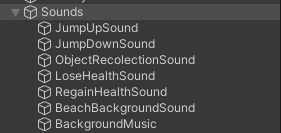
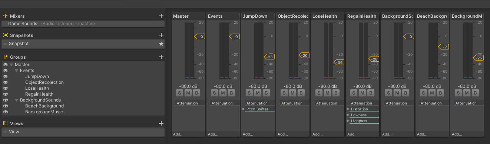
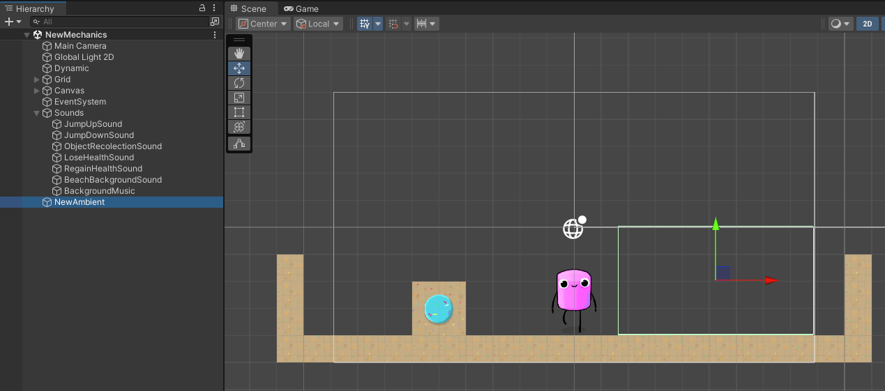

# Sonido en Unity - FDV

## Tarea 1

### Enunciado

Configurar una escena simple en 3D con un objeto cubo que hará de player y varias esferas de color. Agregar un objeto AudioSource desde el menú *GameObject → Audio*. Seleccionar un clip de audio en algún paquete de la Asset Store de tu gusto y adjuntarlo a una esfera. El audio se debe reproducir en cuanto se carga la escena y en bucle.

### Resolución

Para esta actividad, he diseñado una escena que incluye un personaje en primera persona y una esfera roja (Figura 1). A la esfera le he asignado un componente `Audio Source`. Además, he creado un script que permite el movimiento en primera persona del personaje.


*Figura 1: Escena básica*

En el componente `Audio Source` le añado un audio y le activo las propiedades de *PlayOnAwake* y *Loop*.


*Figura 2: Configuración básica del Audio Source*

## Tarea 2

### Enunciado

En la escena anterior crea un objeto con una fuente de audio a la que le configures el efecto Doppler elevado y que se mueva a al pulsar la tecla m a una velocidad alta. Explica los efectos que produce:

- **Incrementar el valor del parámetro `Spread`**
- **Cambiar la configuración de Min Distance y Max Distance**
- **Cambiar la curva de Logarithmic Rollof a Linear Rollof**

### Resolución

Al incrementar el valor del `Spread`, el sonido se comporta menos como si viniera de un punto específico y más como si “rodeara” al oyente. Esto hace que sea menos direccional y contribuye a una sensación de inmersión, como si el sonido viniera de todas partes en lugar de un solo lugar. Por ejemplo, si escuchas algo a la izquierda al aumentar el valor del `Spread` los empiezas a escuchar por detrás tuyo incluso hasta llegar a la parte derecha de tu cabeza.

Al cambiar el `Min distance`, se define alrededor de la fuente de audio un radio dentro del cual el volumen del sonido permanece constante y al máximo posible, sin importar cuán cerca esté el jugador dentro de ese rango. Además, si se cambia la `Max Distance` el audio se reduce hasta este radio si sales del radio se dejará de escuchar.

> Hay que tener en cuenta que si se usa el `Logarithmic Rollof` el audio se escucha siempre por mucho que te alejes, si le activo el `Linear Rollof` el volumen baja al 0 cuando sales del radio definido por `Max Distance`.

Al cambiar a `Linear Rolloff`, el audio deja de escucharse al salirse del radio ya definido previamente en el Max Distance.

## Tarea 3

### Enunciado

Configurar un mezclador de sonidos, aplica a uno de los grupo un filtro de echo y el resto de filtros libre. Configura cada grupo y masteriza el efecto final de los sonidos que estás mezclando. Explica los cambios que has logrado con tu mezclador.

### Resolución

En está actividad primero añadí la configuración básica del Audio Mixer, donde por un lado tenemos el grupo **Master** que hace de controlador principal y dentro de este creamos grupos para nuestros sonidos. Dentro de este grupo **Master** cree mi grupo llamado **Test** donde añadí una serie de efectos para modificar el sonido.

Antes de hablar sobre los efectos que le añadí al sonido, atenue el volumen del grupo **Master** para que no sonora tan fuerte el clip de audio. 


*Figura 3: Configuración del Audio Mixer*

Inicialmente, el sonido era solo un golpe contra metal, pero al añadir una serie de efectos, comenzó a sonar como el disparo de una escopeta. Sin embargo, al ajustar los efectos y refinar la mezcla, logré transformar nuevamente el sonido, pasando de ese disparo inicial a un golpe metálico intenso y realista.

Primero, añadí un efecto de **eco** para crear un sonido de reverberación similar al **eco** que percibimos en la vida real. Ajusté el parámetro de **decay** para hacer que el **eco** se desvanezca de manera gradual, logrando así un efecto más natural y realista.

Además, incorporé un efecto de **distorsión** para transformar el sonido, de modo que, en lugar de sonar como una escopeta, se asemeje al impacto de una herramienta mecánica, como un golpe fuerte de metal contra metal. Este ajuste agrega una textura metálica intensa y contundente, brindando una experiencia sonora más industrial y cruda.


*Figura 4: Efectos del grupo Test*

## Tarea 4  

### Enunciado

Implementar un script que al pulsar la tecla **P** accione el movimiento de una esfera en la escena y reproduzca un sonido en bucle hasta que se pulse la tecla **S**.

### Resolución

En esta actividad cree un script para los controles del sonido y movimiento del objeto.

Lo más importante de este script es que uso la tecla O en vez de la S porque esta tecla ya la uso para el movimiento del jugador. Además del uso del Audio Source para el control del sonido de este componente.

```csharp
public class SphereMovement : MonoBehaviour
{
    public Transform objective;
    public float speed = 2.5f;
    public AudioSource audioSource;

    private bool isMoving = false;

    private void Awake()
    {
        audioSource = GetComponent<AudioSource>();
    }

    void Update()
    {
        if (Input.GetKeyDown(KeyCode.P))
        {
            if (!isMoving)
            {
                isMoving = true;
                audioSource.Play();
                audioSource.loop = true;
            }
        }

        if (Input.GetKeyDown(KeyCode.O))
        {
            isMoving = false;
            audioSource.Stop();
        }

        if (isMoving)
        {
            Vector3 direccion = (objective.position - transform.position).normalized;
            transform.Translate(direccion * speed * Time.deltaTime, Space.World);
        }
    }
}
```

## Tarea 5 

### Enunciado

Implementar un script en el que el cubo-player al colisionar con las esferas active un sonido.

### Resolución

```csharp
public class CharacterCollision : MonoBehaviour
{
    public AudioSource audioSource;

    private void OnCollisionEnter(Collision collision)
    {
        if (collision.gameObject.CompareTag("Sphere"))
        {
            audioSource.Play();
        }
    }
}
```

## Tarea 6

### Enunciado

Modificar el script anterior para que según la velocidad a la que se impacte, el cubo lance un sonido más fuerte o más débil.

### Resolución

```csharp
public class CharacterCollision : MonoBehaviour
{
    public AudioSource audioSource;

    public float maxVolume = 1.0f;
    public float minVolume = 0.1f; 
    public float maxImpactSpeed = 5f; 

    private float playerSpeed;
    private float volume;

    private void Awake()
    {
        playerSpeed = this.gameObject.GetComponent<CharacterMovement>().speed;
        Debug.Log(playerSpeed);
    }

    private void OnCollisionEnter(Collision collision)
    {
        if (collision.gameObject.CompareTag("Sphere"))
        {
            if (playerSpeed >= maxImpactSpeed)
            {
                volume = maxVolume;
            } 
            else if (playerSpeed < maxImpactSpeed)
            {
                volume = minVolume;
            }

            audioSource.volume = volume;

            audioSource.Play();
        }
    }
}
```

## Tarea 7

### Enunciado

Agregar un sonido de fondo a la escena que se esté reproduciendo continuamente desde que esta se carga. Usar un mezclador para los sonidos.

### Resolución


*Figura 7: Efectos del grupo Background*

## Tarea 8

### Enunciado

Crear un script para simular el sonido que hace el cubo-player cuando está en movimiento en contacto con el suelo (mecánica para reproducir sonidos de pasos).

### Resolución

```csharp
public class FootstepSounds : MonoBehaviour
{
    public AudioSource footstepsAudio;
    private bool isGrounded;

    private void Update()
    {
        if (isGrounded && (Input.GetKey(KeyCode.W) || Input.GetKey(KeyCode.A) || Input.GetKey(KeyCode.S) || Input.GetKey(KeyCode.D)))
        {
            if (!footstepsAudio.isPlaying)
            {
                footstepsAudio.Play();
            }
        }
        else
        {
            if (footstepsAudio.isPlaying)
            {
                footstepsAudio.Stop();
            }
        }
    }

    private void OnCollisionStay(Collision collision)
    {
        if (collision.gameObject.CompareTag("Floor"))
            isGrounded = true;
    }

    private void OnCollisionExit(Collision collision)
    {
        if (collision.gameObject.CompareTag("Floor"))
            isGrounded = false;
    }
}
```

## Tarea 9

### Enunciado

En la escena de tus ejercicios 2D incorpora efectos de sonido ajustados a los siguientes requisitos:
Crea un grupo SFX en el AudioMixer para eventos:
- Movimiento del personaje: Crea sonidos específicos para saltos y aterrizajes.
- Interacción y recolección de objetos: Diseña sonido para la recolección de objetos.
- Indicadores de salud/vida: Diseña un sonido breve y distintivo para cada cambio en el estado de salud (por ejemplo, ganar o perder vida).
Crea un grupo Ambiente:
- Crea un sonido de fondo acorde con el ambiente
- Agrega una zona específica del juego en que el ambiente cambie de sonido
Crea un grupo para música: 
- Crea un loop de música de fondo acorde al tono del juego

### Resolución

He usado el proyecto de Mapa y Físicas en Unity 2D de un entregable Anterior. Dentro de este proyecto he modificado el script de `PlayerMovement` para poder incluir los efectos de sonido cuando ocurran ciertos eventos.

Antes de hablar sobre las modificaciones he tenido que crear los grupos para los diferentes sonidos. Para cada tipo de evento cree un **AudioMixer** distinto, primero cree dos grupos; uno para los eventos llamado `Eventos` y otro para los sonidos de fondo llamado `backgroundSounds`. Dentro del grupo de `Eventos` creo un grupo para cada tipo de evento que se pide y por otro lado dentro del grupo de `backgroundSounds` los sonidos del ambiente y la música del juego.

Cada gameObject de audio tiene su `AudioSource` y a su vez cada `AudioSource` tiene su `AudioMixer` asignado para poder añadir efectos a cada audio.



*Figura X: GameObject que contiene los GameObjects con AudioSource*



*Figura X: Grupos del AudioMixer*

En el script de Player Movement añadí los atributos de `AudioSource` para cada audio dentro del grupo de eventos. 

Para los eventos de salto y caida del salto he aprovechado el if de cuando el jugador presiona la tecla de salto para reproducir el sonido de salto y cuando cae al suelo se reproduce el sonido de caida al suelo.

Para la recolección de objetos aprovecho el `OnCollisionEnter2D` para que se reproduzca el Sonido cuando el jugador recoge un objeto.

Para los indicadores de Salud y de Vida, solamente creo los gameObjects necesarios para generar el sonido y su `AudioMixer` para controlar los efectos del mismo.

Para el Ambiente y su cambio de sonido lo hice de la siguiente manera. Cree un `BoxCollider2D` para que cuando el jugador este dentro de ese `BoxCollider2D` cambie el clip de audio del ambiente y si el jugador se sale de este collider simplemente se vuelve al clip de audio por defecto.



*Figura X: BoxCollider2D para el cambio de clip de Audio*

```csharp
public class PlayerMovement : MonoBehaviour
{
    public AudioSource jumpUpSound;
    public AudioSource jumpDownSound;
    public AudioSource objectRecolectionSound;
    public AudioSource ambientSound;
    public AudioClip ambient;
    public AudioClip newAmbient;

    ...

    void FixedUpdate()
    {
        Movement();
    }

    private void Movement()
    {
        float moveH = Input.GetAxis("Horizontal");

        if (Input.GetButton("Jump") && !isJumping)
        {
            rb2D.AddForce(transform.up * thrust);
            jumpUpSound.Play();
            isJumping = true;
        }

        ...
    }

    private void OnCollisionEnter2D(Collision2D other)
    {
        if (other.gameObject.CompareTag("Floor") || other.gameObject.CompareTag("Platform"))
        {
            jumpDownSound.Play();
            isJumping = false;
            rb2D.velocity = new Vector2(rb2D.velocity.x, 0);
        }

        ...

        if (other.gameObject.CompareTag("Item"))
        {
            objectRecolectionSound.Play();
            AddItem(other);
        }
    }

    ...

    private void OnTriggerEnter2D(Collider2D collision)
    {
        if (collision.gameObject.CompareTag("NewAmbient"))
        {
            ambientSound.clip = newAmbient;
            ambientSound.Play();
        }
    }

    private void OnTriggerExit2D(Collider2D collision)
    {
        if (collision.gameObject.CompareTag("NewAmbient"))
        {
            ambientSound.clip = ambient;
            ambientSound.Play();
        }
    }
}
```